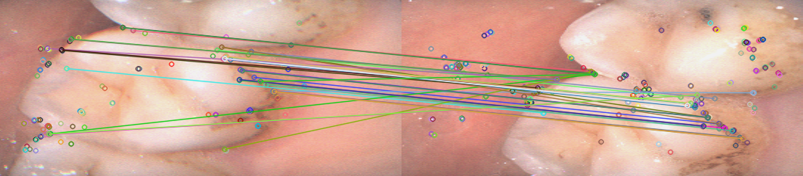

# paper
## [NeRF-SLAM: Real-Time Dense Monocular SLAM with Neural Radiance Fields.](https://arxiv.org/abs/2210.13641 )
### METHODS
Aiming at the problem of real-time and accurate 3D scene reconstruction from monocular images,the article conbines dense monocular SLAM and and neural radiance fields to achieve better geometric and photometric accuracy.

---------------------------------------------------------------------------------------------------------------------
---------------------------------------------------------------------------------------------------------------------
# Code  
## 1.Code link
[NeRF-SLAM](https://github.com/ToniRV/NeRF-SLAM)  
[Orbeez-SLAM](https://github.com/MarvinChung/Orbeez-SLAM)  
[ORB Algorithm](https://github.com/gaoxiang12/slambook2/tree/master/ch7)
## 2.Results
ORB:
 
$~~~~~~~~~~~~~~~~~~~~~~~~~~~$Good-matcehs 
NeRF-SLAM:
$~~~$ .gif)
 $~~~~~~~~~~~~~~~~~~~$NeRF-SLAM(demo)
---------------------------------------------------------------------------------------------------------------------
---------------------------------------------------------------------------------------------------------------------
# Other 
[口内1_ORB分析报告](Reports/口内1_ORB分析报告.pdf)  
[NeRF-SLAM分析报告](Reports/NeRF-SLAM分析报告.pdf)  
[Orbeez-SLAM分析报告](Reports/Orbeez-SLAM分析报告.pdf)
---------------------------------------------------------------------------------------------------------------------
---------------------------------------------------------------------------------------------------------------------
# Summary
1. Run the demo of NeRF-SLAM.
2. Run the demo of Orbeez-slam and try to replace it with your own dataset.
3. Use the algorithm,Oriented FAST and Rotated BRIEF,to Extract the features of each pair of images in the dataset and match them

# Plan 
1. Use Eight-point-algorithm to calculate Essential Matix and restore the R,t of the camera.
2. Keep learning *Visual SLAM 14 Lectures*
# Problem
1. We need to calibrate the camera and get camer instrisics.

