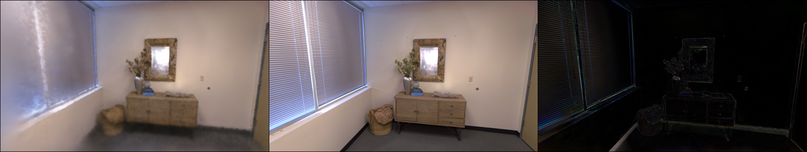

# paper
## [Calibration of Intraoral 3-D Measurement System With Using Consummated Model CombinedWith Highly Accurate Data Pairs](https://ieeexplore.ieee.org/document/10274698 )
### METHODS

---------------------------------------------------------------------------------------------------------------------
---------------------------------------------------------------------------------------------------------------------
# Code  
## 1.Code link
[Use the eight-point algorithm estimates R and t.](code/pose_estimation_2d2d.cpp)  
[To get ORB-Slam3 dataset](code/work.py)  
[Camera_calibrate_parameters](code/camera_calibrate%20parameters.txt)  
## 2.Results
Generated:    &nbsp;&nbsp;&nbsp;&nbsp;&nbsp;&nbsp;&nbsp;&nbsp;
.png)
 &nbsp;&nbsp;&nbsp;&nbsp;&nbsp;&nbsp;&nbsp;
&nbsp;&nbsp;&nbsp;&nbsp;&nbsp;&nbsp;&nbsp;&nbsp;
&nbsp;&nbsp;&nbsp;&nbsp;&nbsp;&nbsp;&nbsp;&nbsp;
&nbsp;&nbsp;&nbsp;&nbsp;&nbsp;&nbsp;&nbsp;&nbsp;&nbsp;
 
Truth:   
&nbsp;&nbsp;&nbsp;&nbsp;&nbsp;&nbsp;&nbsp;&nbsp;
.png)
 The pose diagram obtained by Party A's data&nbsp;&nbsp;&nbsp;&nbsp;&nbsp;&nbsp;&nbsp;
&nbsp;&nbsp;&nbsp;&nbsp;&nbsp;&nbsp;&nbsp;&nbsp;
&nbsp;&nbsp;&nbsp;&nbsp;&nbsp;&nbsp;&nbsp;&nbsp;
&nbsp;&nbsp;&nbsp;&nbsp;&nbsp;&nbsp;&nbsp;&nbsp;&nbsp;
---------------------------------------------------------------------------------------------------------------------
---------------------------------------------------------------------------------------------------------------------
# Other 
1.Remaing Question:  
   
The right part of the picture is about edge detection,it can perform 
three-dimensional reconstruction more accurately.  

---------------------------------------------------------------------------------------------------------------------
---------------------------------------------------------------------------------------------------------------------
# Summary
1.Use the eight-point algorithm estimates R and t. 
2.Use the evo to draw realistic and self-generated pose maps 
3.Calibrate the project's camera.
# Plan 
1. Use other codes to get intrisic parameters of the camera.
2. Keep learning *Visual SLAM 14 Lectures*

# Problem
1.Self-generated pose maps are wrong,I need to fix them.

