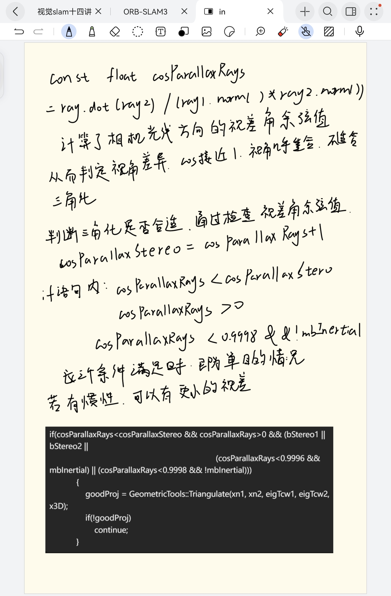
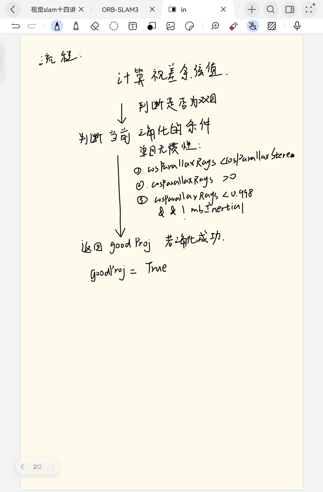
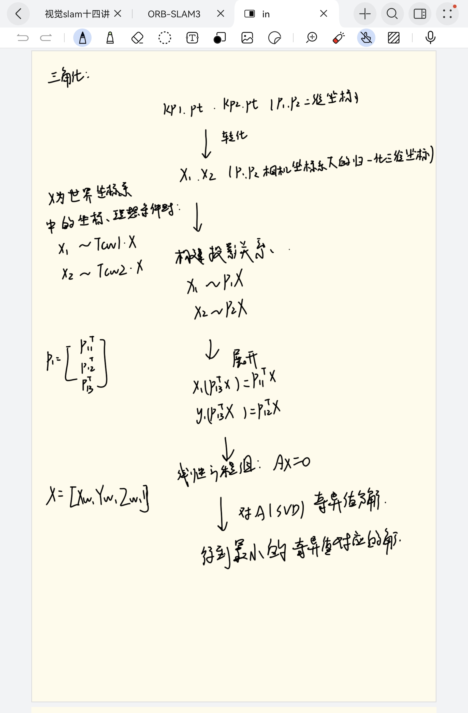

# paper
## 
### METHODS

---------------------------------------------------------------------------------------------------------------------
---------------------------------------------------------------------------------------------------------------------
# Code  
## 1.Code link
[Code comments:"LocalMapping::CreateNewMapPoints"](code/LocalMapping.cc)  

## 2.Results
Flow chart:    &nbsp;&nbsp;&nbsp;&nbsp;&nbsp;&nbsp;&nbsp;&nbsp;

 &nbsp;&nbsp;&nbsp;&nbsp;&nbsp;&nbsp;&nbsp;
&nbsp;&nbsp;&nbsp;&nbsp;&nbsp;&nbsp;&nbsp;&nbsp;
&nbsp;&nbsp;&nbsp;&nbsp;&nbsp;&nbsp;&nbsp;&nbsp;
&nbsp;&nbsp;&nbsp;&nbsp;&nbsp;&nbsp;&nbsp;&nbsp;&nbsp;
 
  
&nbsp;&nbsp;&nbsp;&nbsp;&nbsp;&nbsp;&nbsp;&nbsp;

 &nbsp;&nbsp;&nbsp;&nbsp;&nbsp;&nbsp;&nbsp;
&nbsp;&nbsp;&nbsp;&nbsp;&nbsp;&nbsp;&nbsp;&nbsp;
&nbsp;&nbsp;&nbsp;&nbsp;&nbsp;&nbsp;&nbsp;&nbsp;
&nbsp;&nbsp;&nbsp;&nbsp;&nbsp;&nbsp;&nbsp;&nbsp;&nbsp;
  
&nbsp;&nbsp;&nbsp;&nbsp;&nbsp;&nbsp;&nbsp;&nbsp;

 &nbsp;&nbsp;&nbsp;&nbsp;&nbsp;&nbsp;&nbsp;
&nbsp;&nbsp;&nbsp;&nbsp;&nbsp;&nbsp;&nbsp;&nbsp;
&nbsp;&nbsp;&nbsp;&nbsp;&nbsp;&nbsp;&nbsp;&nbsp;
&nbsp;&nbsp;&nbsp;&nbsp;&nbsp;&nbsp;&nbsp;&nbsp;&nbsp;
---------------------------------------------------------------------------------------------------------------------
---------------------------------------------------------------------------------------------------------------------
# Other 

---------------------------------------------------------------------------------------------------------------------
---------------------------------------------------------------------------------------------------------------------
# Summary
1.Get four sets of datasets. 
2.Configure the programming environment. 
3.Comment on the code.
4.Run a monocular camera on ORB-SLAM3
# Plan 
1. Write code for triangulation.
2. Keep learning *Visual SLAM 14 Lectures*
3. Read a paper.

# Problem

