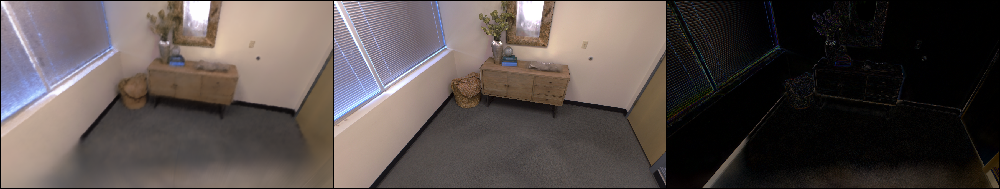

# paper
## [NICER-SLAM: Neural Implicit Scene Encoding for RGB SLAM](https://drive.google.com/file/d/15IwFnyt2Oao5j-qHnPXqL4K1zuAHLIPD/view)
### METHODS
This paper uses serval models,which integrates monocular geometric cues.These cues are used as additional supervision to optimize rendering.For example,the omnidata pre-trained model is used to generate the estimated depth map and normal map from the input RGB map, and the gmflow pre-trained model is used to generate the relevant optical flow map.  

---------------------------------------------------------------------------------------------------------------------
---------------------------------------------------------------------------------------------------------------------
# Code  
## 1.Code Link
[NICER-SLAM代码](https://github.com/cvg/nicer-slam)
## 2.Results

  
The above two pictures show the results of the code.Each picture has three parts. The section on the left is a rendering. The middle part is a real picture.The section on the right is a generated graph of edge detection.
---------------------------------------------------------------------------------------------------------------------
---------------------------------------------------------------------------------------------------------------------
# Other
[Nicer-SLAM分析报告](Reports/Nicer-SLAM分析报告.pdf)  
---------------------------------------------------------------------------------------------------------------------
---------------------------------------------------------------------------------------------------------------------
# Summary
1. Run the demo of Nicer-slam.
2. Run the demo of Nice-slam.
3. Read the paper of *Nicer-slam*
# Plan 
1. Try to use other models to reconstruct the oral model.
2. Keep learning *Visual SLAM 14 Lectures*
# Problem
1. The inputs of *Nicer-slam* are not only monocular images,but also other data,such as depth images,mesh.ply and optical flow information.

