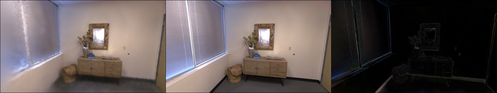
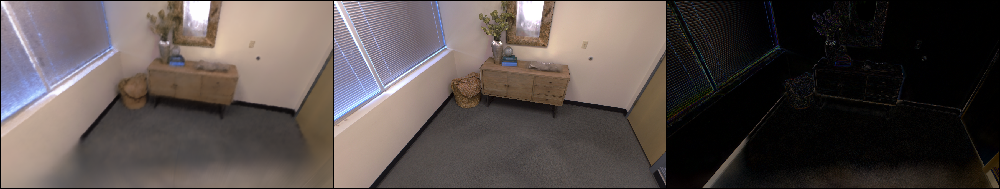

# paper
## [NICER-SLAM: Neural Implicit Scene Encoding for RGB SLAM](https://drive.google.com/file/d/15IwFnyt2Oao5j-qHnPXqL4K1zuAHLIPD/view)
### METHODS
1.这篇文章使用了多个模型This paper uses serval models，通过整合单目几何线索这些被用来作为额外监督进行优化which integrates monocular geometric cues.These cues are used as additional supervision to optimize rendering.如使用omnidata预训练模型通过输入的RGB图来生成估计的深度图和法线图，使用gmflow预训练模型来生成相关的光流图。For example,the article  
2.该系统仅以 RGB 视频流作为输入，就能输出高质量的 3D 重建结果并恢复准确的相机位姿，拓展了应用场景

---------------------------------------------------------------------------------------------------------------------
---------------------------------------------------------------------------------------------------------------------
# Code  
## 1.代码链接
[NICER-SLAM代码](https://github.com/cvg/nicer-slam)
### 2.代码运行结果

---------------------------------------------------------------------------------------------------------------------
---------------------------------------------------------------------------------------------------------------------
# Other
暂无 
---------------------------------------------------------------------------------------------------------------------
---------------------------------------------------------------------------------------------------------------------
# Summary
1. 跑通了Nicer-slam项目的Demo和Replica数据集
2. 跑通了Nice-slam项目的Demo数据集
3. 阅读了Nicer-slam的论文
# Plan 
1. 继续尝试用nicer-slam或其他模型重建口腔
2. 学习slam14讲
# Problem
1. 发现运行nicer-slam的输入不仅仅是RGB图，还需要其他数据如光流、深度图等作为监督，优化效果
2. 文章中说本文可以仅以RGB图像作为输入，但并未发现直接输入RGB图像的示例
